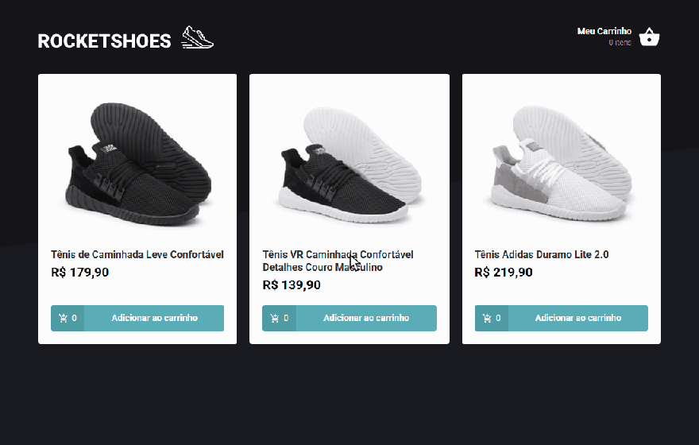
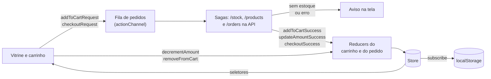

# 👟 Rocket Shoes

<div align="center">
  
  
  
  
  
  
  
  
</div>

<br>

> 🎯 **Loja de tênis em React com o carrinho na arquitetura Flux**, usando Redux Toolkit para o estado e Redux Saga para consultar o estoque antes de cada mudança no carrinho.

Fiz em 2020 para estudar a arquitetura Flux, e o repositório se chamava Arquitetura-Flux. Em 2026 voltei a ele: troquei o Create React App (descontinuado) pelo Vite, corrigi os bugs, completei a loja com carrinho salvo, carrinho vazio e pedido gravado na API, e passei o store para o Redux Toolkit mantendo os sagas.

<p align="center">
  
</p>

## 📋 Índice

- [🚀 Como rodar](#-como-rodar)
- [✨ Recursos](#-recursos)
- [🧩 Como o código funciona](#-como-o-código-funciona)
- [🔄 Revisitando o projeto em 2026](#-revisitando-o-projeto-em-2026)
- [📄 Licença](#-licença)

## 🚀 Como rodar

Precisa de Node 22.12 ou mais novo e do Yarn.

```bash
yarn
```

A loja busca produtos e estoque e grava os pedidos numa API fake, servida pelo json-server. Suba a API num terminal:

```bash
yarn server
```

E o app em outro:

```bash
yarn dev
```

Depois abra http://localhost:5173.

A API sobe em `http://127.0.0.1:3333`. O `yarn server` copia o `server.json` para `db.json` e serve a cópia, porque o json-server grava no arquivo: a cada execução o estoque volta ao original e os pedidos começam do zero. Para usar outro endereço, crie um `.env.local` com `VITE_API_URL` (modelo no `.env.example`).

Outros comandos:

| Comando | O que faz |
|---|---|
| `yarn test` | Roda os 34 testes (Vitest e Testing Library) |
| `yarn lint` | Roda o ESLint, que também confere a formatação do Prettier |
| `yarn format` | Formata o código com o Prettier |
| `yarn build` | Roda o lint e gera a versão de produção na pasta `dist` |
| `yarn preview` | Serve a pasta `dist` localmente |

Com a extensão [Redux DevTools](https://github.com/reduxjs/redux-devtools) instalada no navegador, dá para acompanhar cada action e o estado do carrinho em modo de desenvolvimento.

## ✨ Recursos

- Vitrine com os produtos da API, aviso de carregamento e aviso de erro quando a API não responde
- Adicionar ao carrinho pela vitrine, com a quantidade de cada produto no botão
- Aumentar, diminuir (até 1) e remover produtos no carrinho, com subtotal e total
- Estoque conferido na API antes de cada aumento de quantidade, com aviso quando não há estoque
- Duplo clique por engano conta como um clique só, na vitrine e no carrinho
- Carrinho salvo no navegador (`localStorage`), que sobrevive ao recarregar a página
- Aviso de carrinho vazio com link de volta à vitrine
- Finalizar pedido: confere o estoque de novo, grava o pedido em `/orders`, baixa o estoque e mostra a confirmação com o número do pedido
- Layout para celular: a vitrine vai de 3 colunas para 1, e o carrinho esconde a foto em telas de até 600 px

## 🧩 Como o código funciona

```
index.html                    página base; o Vite injeta o src/main.jsx
server.json                   produtos, estoque e pedidos iniciais da API fake
demo/rocket-shoes.gif         demonstração
src/
├── main.jsx                  ponto de entrada: monta o App no #root
├── App.jsx                   store, rotas, cabeçalho, estilo global e avisos
├── routes.jsx                / (vitrine) e /cart (carrinho)
├── services/api.js           axios apontando para VITE_API_URL
├── util/
│   ├── format.js             formatPrice, em reais
│   └── singleClick.js        ignora o segundo clique de um duplo clique
├── styles/                   estilo global e cores da marca
├── components/Header/        logo e quantidade de itens no carrinho
├── pages/
│   ├── Home/                 vitrine
│   └── Cart/                 carrinho
├── store/
│   ├── index.js              store da aplicação, com o carrinho salvo no navegador
│   ├── createAppStore.js     configureStore com o middleware do Saga
│   ├── cartStorage.js        lê e grava o carrinho no localStorage
│   └── modules/
│       ├── cart/
│       │   ├── reducer.js    slice do carrinho (createSlice)
│       │   ├── actions.js    actions do slice e o pedido que passa pelo estoque
│       │   ├── sagas.js      fila de pedidos, estoque e gravação do pedido
│       │   └── selectors.js  quantidade por produto, subtotal e total
│       └── order/            envio do pedido (enviando e número do último pedido)
└── test/setup.js             matchers do jest-dom e limpeza entre os testes
```

O fluxo segue a arquitetura Flux: a tela nunca altera o carrinho direto, ela despacha uma action, e o estado só muda no reducer.



- **Dois tipos de action.** O que depende da API (adicionar, aumentar e finalizar) vira um pedido, tratado pelos sagas. O que não depende (diminuir e remover) vai direto ao reducer.
- **Sagas (`sagas.js`).** Os pedidos entram numa fila e são atendidos um de cada vez. `hasStock` consulta `/stock/:id` e mostra o aviso quando a quantidade passa do estoque. Produto novo no carrinho busca os dados em `/products/:id`. Finalizar confere o estoque de todos os produtos, grava o pedido e baixa o estoque de cada um.
- **Pedido (`modules/order`).** Guarda se o pedido está sendo enviado, para desabilitar os botões do carrinho nesse meio tempo, e o número do último pedido, para a confirmação.
- **Estado mínimo.** O carrinho guarda só os dados do produto e a quantidade. Preço formatado, subtotal e total saem dos seletores em `selectors.js`, com `createSelector`, que só recalcula quando o carrinho muda.
- **Telas.** Componentes de função com `useSelector` e `useDispatch`. Cada pasta de página tem o `index.jsx` com o componente e o `styles.js` com os componentes do styled-components usados só nela.

## 🔄 Revisitando o projeto em 2026

O projeto não rodava mais: o `react-scripts 3.4` usa o webpack 4, que calcula hashes com MD4, e o OpenSSL 3 do Node 17 em diante recusa esse algoritmo (`ERR_OSSL_EVP_UNSUPPORTED`). Contornando isso, a revisão achou um build de produção que não abria e um carrinho que perdia cliques.

### 🐛 Bugs corrigidos

| Bug | Causa | Correção |
|---|---|---|
| Tela em branco no build de produção | Fora do modo de desenvolvimento o enhancer era `null`, e o `createStore` recebia `null` como estado inicial | O middleware do Saga entra sempre; só o DevTools depende do modo |
| Clicar num produto e logo em outro deixava só o segundo no carrinho | `takeLatest` valia para todos os produtos e cancelava o pedido anterior | Fila de pedidos com `actionChannel` |
| Dois cliques no mesmo produto antes da resposta do estoque davam quantidade 1 | Mesma causa | Mesma fila: cada pedido parte do carrinho que o anterior deixou |
| Dois cliques no + ou no - do carrinho mudavam a quantidade só uma vez | Os botões mandavam a quantidade da tela mais ou menos 1, e os dois cliques mandavam o mesmo número | O + usa o mesmo pedido da vitrine, que soma 1 ao carrinho atual; o - vai direto ao reducer |
| Depois de uma falha de rede, o carrinho parava de responder | O erro subia até o saga raiz e o encerrava | Erro tratado na fila, com aviso, e a fila continua |
| Vitrine vazia e sem aviso com a API fora do ar | A busca dos produtos não tinha `catch` | Aviso de erro na vitrine |
| "1 itens" no cabeçalho | Plural fixo | "1 item" e "2 itens" |

Cada correção tem um teste que falhava antes e passa depois.

### 🧠 Decisões técnicas

**Vite no lugar do Create React App**

O Create React App foi descontinuado. O Vite resolve o build sem mudar a arquitetura: só o ponto de entrada muda (`index.html` na raiz e arquivos com JSX em `.jsx`).

- React 16 para 19, com `createRoot`.
- O fundo escuro sumiu na troca: o Vite embute o `background.svg` como data URI, o texto do SVG tem parênteses, e dentro de `url()` sem aspas eles invalidam a declaração inteira. A URL agora vai entre aspas.
- React Router 5 para 7: `Routes` e `element` no lugar de `Switch` e `component`.
- ESLint 10 com configuração flat e Prettier ligado ao lint, no lugar do `eslintConfig` do CRA.

**Redux DevTools no lugar do Reactotron**

O Reactotron depende de um app desktop, e o plugin dele para o Saga está parado na versão que o projeto já usava. A extensão Redux DevTools mostra as actions e o estado no próprio navegador, e o `configureStore` já liga a extensão sozinho.

**Redux Toolkit mantendo o Redux Saga**

O Redux Toolkit é hoje a forma recomendada de escrever Redux: `createSlice` substituiu o reducer com `switch` e as actions escritas à mão, e os tipos deixaram de ser texto repetido em três arquivos. O RTK Query ou o listener do Toolkit poderiam substituir os sagas, mas o projeto existe para estudar o fluxo Flux com efeitos isolados, então os sagas ficaram.

**Fila de pedidos no lugar do `takeLatest`**

O `takeLatest` cancelava o pedido anterior, de qualquer produto. O `takeEvery` também não resolveria: dois cliques no mesmo produto leriam o carrinho vazio ao mesmo tempo e criariam duas linhas do mesmo tênis. Com a fila (`actionChannel`), cada pedido espera o anterior terminar. O custo é que cliques seguidos esperam a resposta do estoque um do outro.

**Duplo clique por engano**

O navegador numera os cliques seguidos em `event.detail` (1, 2, 3...) dentro do intervalo de duplo clique do sistema. `singleClick` só aceita o primeiro, então um duplo clique por engano adiciona uma unidade, não duas. A alternativa era um intervalo fixo em milissegundos, mas o do sistema respeita a configuração de cada pessoa. O custo: quem clicar de propósito várias vezes muito rápido também conta um clique só até passar o intervalo.

**Pedido gravado na API**

Finalizar confere o estoque de novo, porque ele pode ter mudado desde que o produto entrou no carrinho, grava o pedido e só então baixa o estoque. O pedido entra na mesma fila dos outros pedidos do carrinho, para nenhuma adição acontecer no meio dele, e os botões do carrinho ficam desabilitados enquanto ele é enviado. O json-server não tem transação: se a baixa de estoque falhar depois de o pedido ser gravado, os dois ficam diferentes. Numa API de verdade isso seria uma operação só, no servidor.

**json-server 0.17**

A linha 1.0 do json-server está em alpha e beta desde dezembro de 2023, então o projeto usa a 0.17.4, a última estável. Por padrão ela escuta em `localhost`, que no Node 24 fica só no IPv6 (`::1`), por isso o script fixa `--host 127.0.0.1`, o mesmo endereço que o app chama.

**Organização do código**

- **Estado sem dado derivado.** O preço formatado era gravado no estado e no `localStorage`, e subtotal e total eram recalculados em cada tela. Agora ficam nos seletores.
- **Componentes de função com hooks.** A vitrine era classe, e as três telas usavam `connect` com `bindActionCreators`, que entregava todas as actions do carrinho a cada tela. Agora cada uma importa só as actions que usa.
- **Checagem de estoque num lugar só.** Adicionar e alterar a quantidade repetiam a consulta, a comparação e o aviso. O saga `hasStock` faz os três.
- **Cor da marca num módulo.** `#5aaeb8` aparecia em 9 lugares; está em `styles/colors.js`, com os tons de hover.
- **Mesmo store na aplicação e nos testes.** `createAppStore` monta o store com os sagas, e os testes usam a mesma função com o carrinho de que precisam.
- **Regras que deixei de fora.** Não criei um tipo próprio para dinheiro (o "envolver primitivos" do object calisthenics): o preço vem da API como número, é somado em um único seletor e formatado por `formatPrice`, e um objeto a mais não resolvia nenhum problema deste código. Também não injeto a `api` nos sagas: os testes trocam o módulo pelo dublê do Vitest, e uma camada de injeção só adicionaria código.
- **Mesmo resultado.** Antes da refatoração gravei o HTML das cinco telas, o estado do store e do `localStorage` depois de uma sequência de cliques, os avisos mostrados e o CSS dos 9 componentes de estilo. A cada passo comparei de novo: ficou idêntico em 7 dos 9, e nos outros 2 só mudou o esperado (o seletor `* body` virou `body` e o estado perdeu o preço formatado). Os testes passaram em todos os passos.

## 📄 Licença

[MIT](LICENSE)

---

<div align="center">
  <p>Desenvolvido por <strong>Luiz Matos</strong></p>
  <p>
    <a href="https://github.com/luiz-matos">GitHub</a> •
    <a href="https://www.linkedin.com/in/luizeduardomatos/">LinkedIn</a>
  </p>
</div>
